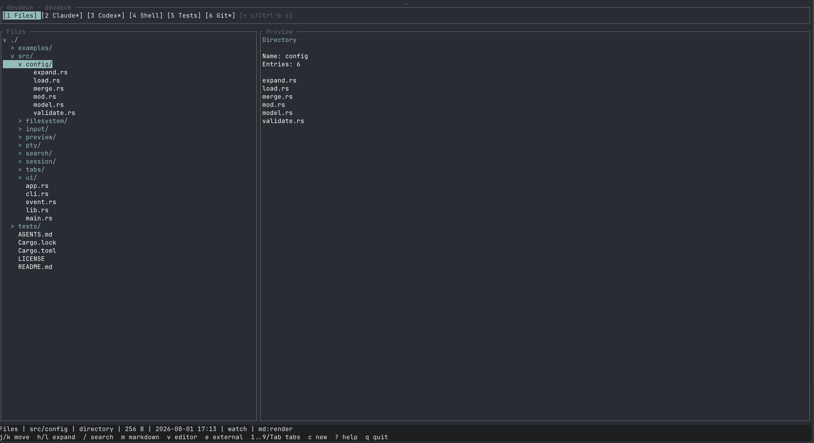
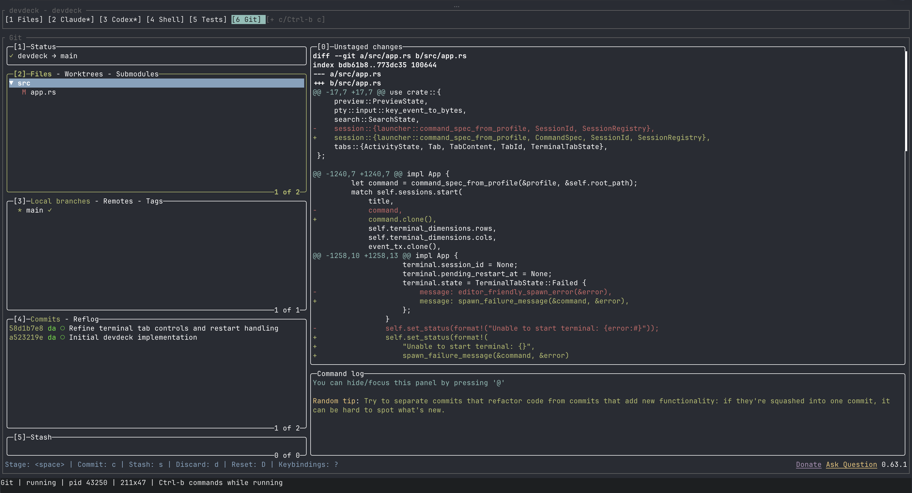

# DevDeck

DevDeck is a terminal workspace for repository browsing and command-line development. It gives you a live file explorer, source/Markdown previews, and configurable PTY-backed command tabs in one focused TUI.

DevDeck runs inside your terminal emulator. It is not a terminal multiplexer, shell replacement, or editor.

## Screenshots

Repository browser with file tree and preview:



Interactive Git tab running `lazygit` inside DevDeck:



## Features

- Repository tree navigation with hidden-file toggle and generated-directory filtering
- Plain text, source-code, binary metadata, and rendered Markdown previews with link navigation
- Independent preview scrolling and automatic refresh on filesystem changes
- Filename search
- Relative and absolute path copying
- External file opening
- Temporary in-DevDeck editor tabs
- Configurable terminal tabs for arbitrary commands
- Interactive PTY sessions with ANSI colors, cursor movement, alternate screens, and terminal resizing
- Lazy-start and auto-start terminal profiles
- Background activity markers
- Restart, stop, close, and process-exit states
- Temporary command tabs
- Configuration reload without killing running sessions
- Help, rename, confirmation, and prompt overlays

Claude Code, Codex, shells, Git tools, and editors are all just configured commands. DevDeck does not hardcode special behavior for any of them.

## Install From Source

Install Rust stable, then build DevDeck:

```bash
. "$HOME/.cargo/env"
cargo build --release
```

The binary is created at:

```bash
./target/release/devdeck
```

Run the test suite:

```bash
cargo test
```

Run from the checkout:

```bash
cargo run -- .
```

## Usage

```bash
devdeck
devdeck .
devdeck /path/to/project
devdeck . --hidden
devdeck . --no-watch
```

If no path is supplied, DevDeck opens the current working directory.

## Configuration

DevDeck loads two TOML files:

1. `~/.config/devdeck/config.toml`
2. `.devdeck.toml` in the repository root

The global file is loaded first. The project file is loaded second. Project profiles replace global profiles with the same `name`, project-only profiles are appended, and global-only profiles remain available.

`Files` is reserved for the repository browser tab and cannot be used as a terminal profile name.

Example:

```toml
version = 1

[workspace]
default_tab = "Files"

[[tabs]]
name = "Claude"
command = "claude"
auto_start = false

[[tabs]]
name = "Codex"
command = "codex"
auto_start = false

[[tabs]]
name = "Shell"
command = "${SHELL}"
auto_start = true

[[tabs]]
name = "Git"
command = "lazygit"
auto_start = false
```

The Git example uses `lazygit`. DevDeck does not bundle `lazygit`; install it separately and make sure it is on `PATH` before starting DevDeck:

```bash
command -v lazygit
```

If you install `lazygit` while DevDeck is already running, restart DevDeck from a shell that can find `lazygit`, or retry the Git tab after confirming the inherited `PATH` is correct.

Each terminal profile supports:

```toml
name = "Shell"
command = "${SHELL}"
args = []
cwd = "."
env = { RUST_BACKTRACE = "1" }
auto_start = false
restart_on_exit = false
```

Expansion rules:

- `~` and environment variables are expanded in `command`, `args`, `cwd`, and environment values.
- Relative `cwd` values resolve against the repository root.
- Commands launch as executable plus argument vector, not through an implicit shell.
- If a configured command is missing, its tab shows `Executable not found: <command>` and DevDeck keeps running.

A copyable sample is available at [examples/devdeck.toml](examples/devdeck.toml).

## Key Bindings

Files tab:

```text
j / Down       Move down
k / Up         Move up
l / Right      Expand or enter
h / Left       Collapse or go to parent
Enter          Open or expand selected entry
g              First entry
G              Last entry
Home           Repository root
.              Toggle hidden files
/              Filename search
m              Toggle rendered/raw Markdown
Ctrl-d         Preview page down
Ctrl-u         Preview page up
J / K          Preview line down/up
0 / $          Preview top/bottom
] / [          Next/previous Markdown preview link
y / Y          Copy relative/absolute path
e              Open externally
v              Open selected file in a temporary editor tab
r / R          Reload file/tree
1..9           Select tab by position
Tab / BackTab  Next/previous tab
c              Create temporary command tab
?              Help overlay
q              Quit with confirmation
```

When a terminal tab is running, normal keyboard input goes directly to the child process. Use the command prefix for DevDeck commands that would otherwise be typed into Claude, Codex, a shell, Vim, Less, or another terminal program.

Command prefix:

```text
Ctrl-b 1..9     Select tab by position
Ctrl-b n        Next tab
Ctrl-b p        Previous tab
Ctrl-b f        Select Files tab
Ctrl-b c        Create temporary command tab
Ctrl-b x        Stop or close current terminal tab
Ctrl-b r        Restart current terminal tab
Ctrl-b e        Reload configuration
Ctrl-b q        Quit with confirmation
Ctrl-b ?        Help overlay
Ctrl-b ,        Rename temporary tab
Ctrl-b Ctrl-b   Send literal Ctrl-b to the child process
```

Inactive terminal tabs also accept direct commands:

```text
Enter / r       Start or restart an exited/failed terminal tab
x               Close a temporary tab or reset a configured tab
1..9            Select tab by position
Tab / BackTab   Next/previous tab
?               Help overlay
q               Quit with confirmation
```

Tab activity markers:

```text
*               Inactive terminal tab has recent output
.               Inactive terminal tab produced output, then went quiet
!               Terminal process exited or failed
```

Prompt overlay:

```text
Ctrl-g          Open prompt overlay for the active running terminal
Enter           Send text plus newline
Alt-Enter       Insert newline
Esc             Cancel
```

When a terminal tab is active, normal keyboard input is sent directly to the running process.

## Editor Behavior

The `e` command opens the selected file outside DevDeck and temporarily restores the terminal while the editor runs.

The `v` command opens the selected file inside DevDeck as a temporary terminal tab. The editor resolves in this order:

1. `$VISUAL`
2. `$EDITOR`
3. `vi`

To use Vim:

```bash
export EDITOR=vim
export VISUAL=vim
devdeck .
```

When an in-DevDeck editor tab exits, focus returns to the Files tab. The exited editor tab remains visible and can be closed with `x` when selected or with `Ctrl-b x` from any running terminal tab.

## Configuration Reload

Use `Ctrl-b e` to reload configuration.

Reload behavior:

- New configured tabs are added.
- Not-started and exited configured tabs are updated in place.
- Changed running configured tabs keep running and are marked `restart required`.
- Removed running configured tabs stay visible and are marked `removed from config`.
- Removed non-running configured tabs are removed.
- Temporary tabs are preserved.

## License

MIT. See [LICENSE](LICENSE).
