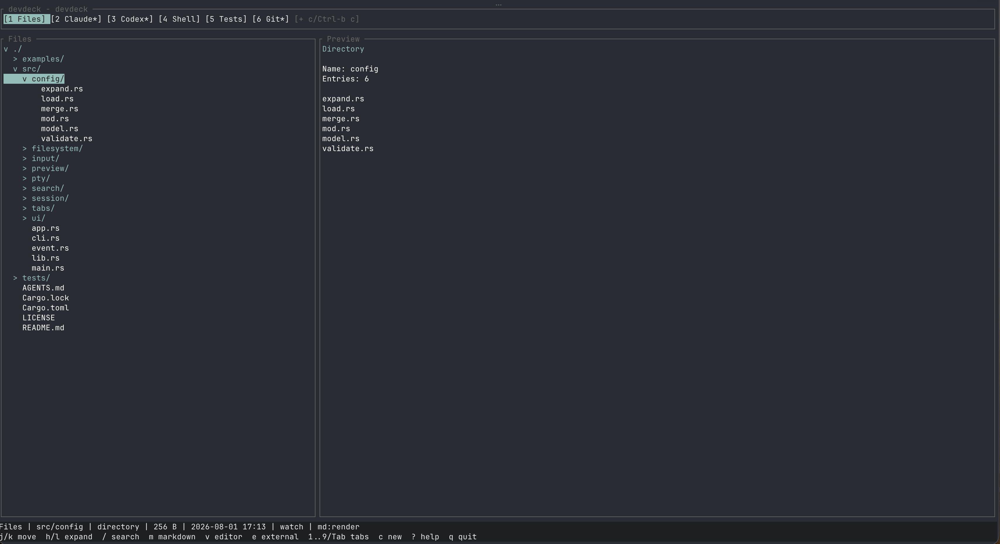
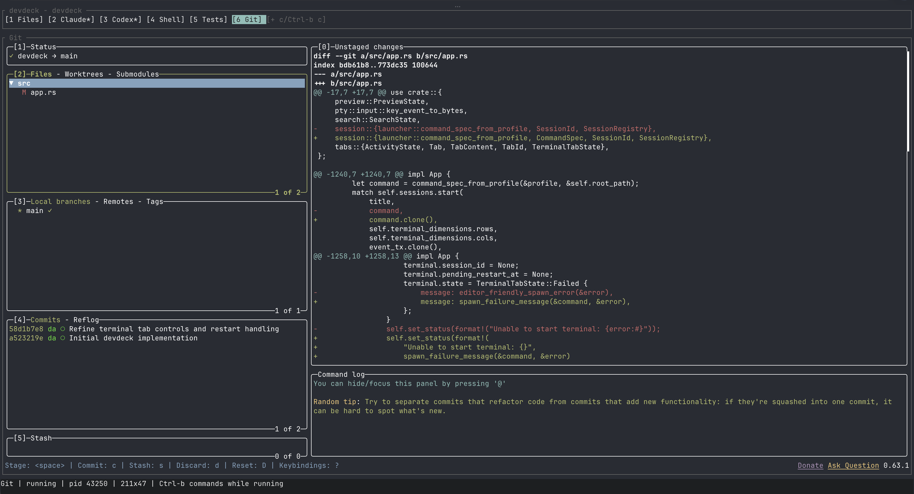

# DevDeck

DevDeck is a terminal workspace for repository browsing and command-line development. It gives you a live file explorer, source/Markdown previews, and configurable PTY-backed command tabs in one focused TUI.

DevDeck runs inside your terminal emulator. It is not a terminal multiplexer, shell replacement, or editor.

## Screenshots

Repository browser with file tree and preview:



Interactive Git tab running `lazygit` inside DevDeck:



## Features

- Repository tree navigation with hidden-file toggle and configurable generated-directory filtering
- Plain text, source-code, image, binary metadata, and rendered Markdown previews with link navigation
- Independent preview scrolling and automatic refresh on filesystem changes
- Session-only marked file lists
- Path reminders with due dates stored per workspace
- Filename search
- File and folder actions for rename, filename copy, relative/absolute path copy, command launch, and agent launch
- External file opening
- Temporary in-DevDeck editor tabs
- Configurable terminal tabs for arbitrary commands
- Interactive PTY sessions with ANSI colors, cursor movement, alternate screens, and terminal resizing
- Lazy-start and auto-start terminal profiles
- Background activity markers
- Restart, stop, close, and process-exit states
- Temporary command tabs
- Configuration reload without killing running sessions
- Help, rename, confirmation, and prompt overlays

Claude Code, Codex, shells, Git tools, and editors are all just configured commands. DevDeck does not hardcode special behavior for any of them.

## Release Notes

### 0.21.0

- Added reliable tab navigation with configurable universal previous/next shortcuts, MRU switching, a searchable tab switcher, and an overflow-safe tab strip.
- Added automatic, selection-first, and navigation mouse policies so Files can use mouse navigation while terminal tabs retain native text selection.
- Added pane-aware file-tree selection, directory expansion, preview scrolling, and stable mouse double-click handling.
- Added keyboard-focused and maximized file previews with wrap control, horizontal scrolling, source line numbers, and visible-range progress.
- Improved large-file and Unicode preview navigation, Markdown link and anchor handling, filesystem rename tracking, and preview-position preservation.
- Added cached syntax highlighting, Markdown rendering, and bounded deep-scroll indexing for responsive previews.
- Added explicit safety limits for Markdown rendering, image decoding and terminal rendering, directory previews, filesystem watcher queues, and preview file reads.
- Improved terminal lifecycle cleanup, modified-key forwarding, configuration reload behavior, contextual help, and status-line discoverability.

### 0.20.2

- Added portable image previews for common image formats using terminal truecolor block rendering.
- Added a larger bounded preview size limit for image files.

### 0.20.1

- Added mouse-wheel scrolling for file previews and terminal tabs.
- Fixed `Shift+Tab` in running terminal tabs by forwarding the reverse-tab escape sequence to the child process.

### 0.2.0

- Added a file actions overlay on `a` for selected files and folders.
- Added file/folder rename from the Files tab.
- Added filename, relative path, and absolute path copy actions.
- Added command launch with the selected path appended as the final argument.
- Added Codex/Claude agent launch from configured profiles with a prompt scoped to the selected path.
- Fixed multiline paste in terminal tabs by forwarding supported pastes as bracketed paste blocks.

## Install From Source

Install Rust stable, then build DevDeck:

```bash
. "$HOME/.cargo/env"
cargo build --release
```

The binary is created at:

```bash
./target/release/devdeck
```

Run the test suite:

```bash
cargo test
```

Run the local release gate and install the binary on macOS or Linux:

```bash
./scripts/local-release.sh
```

The script checks formatting, runs Clippy with warnings denied, runs the test
suite, builds the release binary, then installs it to `$HOME/.local/bin/devdeck`
by default. On macOS, it uses ad-hoc signing unless `CODESIGN_IDENTITY` is set
to a specific signing identity. Set `DEVDECK_INSTALL_DIR` to install somewhere
else.

Run from the checkout:

```bash
cargo run -- .
```

## Usage

```bash
devdeck
devdeck .
devdeck /path/to/project
devdeck . --hidden
devdeck . --no-watch
```

If no path is supplied, DevDeck opens the current working directory.

## Configuration

DevDeck loads two TOML files:

1. `~/.config/devdeck/config.toml`
2. `.devdeck.toml` in the repository root

The global file is loaded first. The project file is loaded second. Project profiles replace global profiles with the same `name`, project-only profiles are appended, and global-only profiles remain available.

`Files` is reserved for the repository browser tab and cannot be used as a terminal profile name.

Example:

```toml
version = 1

[workspace]
default_tab = "Files"
# Directory names omitted from the file tree. Set to [] to disable this filter.
ignored_directories = [".git", "target", "node_modules", ".dart_tool", "dist", "coverage", ".idea"]
# Universal tab navigation. Supported values: Alt-Left, Alt-Right, Ctrl-Left,
# and Ctrl-Right. Previous and next must use different bindings.
previous_tab_key = "Alt-Left"
next_tab_key = "Alt-Right"
# auto, selection, or navigation
mouse_policy = "auto"

[[tabs]]
name = "Claude"
command = "claude"
auto_start = false

[[tabs]]
name = "Codex"
command = "codex"
auto_start = false

[[tabs]]
name = "Shell"
command = "${SHELL}"
auto_start = true

[[tabs]]
name = "Git"
command = "lazygit"
auto_start = false
```

The Git example uses `lazygit`. DevDeck does not bundle `lazygit`; install it separately and make sure it is on `PATH` before starting DevDeck:

```bash
command -v lazygit
```

If you install `lazygit` while DevDeck is already running, restart DevDeck from a shell that can find `lazygit`, or retry the Git tab after confirming the inherited `PATH` is correct.

Each terminal profile supports:

```toml
name = "Shell"
command = "${SHELL}"
args = []
cwd = "."
env = { RUST_BACKTRACE = "1" }
auto_start = false
restart_on_exit = false
```

Expansion rules:

- `~` and environment variables are expanded in `command`, `args`, `cwd`, and environment values.
- Relative `cwd` values resolve against the repository root.
- `workspace.ignored_directories` matches directory names case-insensitively. Project config replaces the global list when set.
- `workspace.previous_tab_key` and `workspace.next_tab_key` configure universal tab navigation; project values override global values independently, and the resolved bindings must be different.
- Claude and Codex profiles without an explicit `cwd` start in the current file-browser folder. If a file is selected, they start in that file's parent directory. Set `cwd` to pin them to a fixed directory.
- Commands launch as executable plus argument vector, not through an implicit shell.
- If a configured command is missing, its tab shows `Executable not found: <command>` and DevDeck keeps running.

A copyable sample is available at [examples/devdeck.toml](examples/devdeck.toml).

## Key Bindings

Files tab:

```text
j / Down       Move down
k / Up         Move up
l / Right      Expand or enter
h / Left       Collapse or go to parent
Enter          Open or expand selected entry
g              First entry
G              Last entry
Home           Repository root
.              Toggle hidden files
/              Filename search
m              Toggle rendered/raw Markdown
Ctrl-d         Preview page down
Ctrl-u         Preview page up
J / K          Preview line down/up
f              Focus the preview pane
Esc            Return preview focus to the file tree
z              Maximize/restore the focused Files pane
w              Toggle wrapping while the preview is focused
h/l or arrows  Scroll horizontally when preview wrapping is off
N              Toggle source-code line numbers while the preview is focused
j/k or arrows  Scroll by line while the preview is focused
g/G            Preview top/bottom while the preview is focused
Alt-m          Cycle mouse policy: auto / selection / navigation
Mouse wheel    Move the file tree or scroll the pane under the pointer
Mouse click    Select a tree row or tab when capture is active
Double click   Expand/enter a folder, or rename a temporary tab
0 / $          Preview top/bottom
] / [          Next/previous Markdown preview link
Space          Mark/unmark selected file or folder for this session
M              Toggle marked-only file list
T              Open reminders list
y / Y          Copy relative/absolute path
a              File actions: rename, copy name/path, run command, run configured agent, reminders
e              Open externally
v              Open selected file in a temporary editor tab
r / R          Reload file/tree
1..9           Select tab by position
Tab / BackTab  Next/previous tab
Alt-Left/Right Previous/next tab (configurable with previous_tab_key/next_tab_key)
Alt-t          Search and switch tabs
Alt-l          Switch to the most recently used tab
c              Create temporary command tab from a known command, shell, or custom command
?              Help overlay
q              Quit with confirmation
```

The focused Files pane has a cyan border. Clicking or scrolling a pane focuses it. The preview
title shows the visible rendered-line range, total rendered lines, and scroll percentage. Source
files show line numbers by default; `N` toggles them for the session, and their number gutter stays
fixed during horizontal scrolling. Wrapping is also session-wide and stays as selected when moving
between files, while each newly selected file starts at the top-left. Both wrapped and unwrapped
previews use full-range windowing, so even content with more than 65,535 rendered rows can reach its
true tail and report 100%. Rendered Markdown, directory summaries, and image previews keep their
fitted/wrapped presentation. In the Help overlay, use `j/k`, PageUp/PageDown, or `g/G` to scroll;
the controls remain visible on small terminals.

When a terminal tab is running, normal keyboard input goes directly to the child process. Use the command prefix for DevDeck commands that would otherwise be typed into Claude, Codex, a shell, Vim, Less, or another terminal program.

The default `auto` mouse policy captures the mouse in Files, where clicks select tree rows, double-clicking a directory expands or enters it, the wheel moves the tree or scrolls the preview under the pointer, and tab clicks change views. Terminal tabs release capture so native text selection works. Use `Alt-m` or `Ctrl-b m` to cycle to `selection` (never capture) or `navigation` (capture everywhere, including terminal scrollback). In full-screen terminal apps that use the alternate screen, navigation-mode wheel events send PageUp/PageDown to the child process. Set `workspace.mouse_policy` to `"auto"`, `"selection"`, or `"navigation"` to choose the startup behavior.

Command prefix:

```text
Ctrl-b 1..9     Select tab by position
Ctrl-b n        Next tab
Ctrl-b p        Previous tab
Ctrl-b t        Search and switch tabs
Ctrl-b l        Switch to the most recently used tab
Ctrl-b f        Select Files tab
Ctrl-b c        Create temporary command tab from a known command, shell, or custom command
Ctrl-b x        Stop or close current terminal tab
Ctrl-b r        Restart current terminal tab
Ctrl-b e        Reload configuration
Ctrl-b m        Cycle mouse policy: auto / selection / navigation
Ctrl-b q        Quit with confirmation
Ctrl-b ?        Help overlay
Ctrl-b ,        Rename temporary tab
Ctrl-b Ctrl-b   Send literal Ctrl-b to the child process
```

Inactive terminal tabs also accept direct commands:

```text
Enter / r       Start or restart an exited/failed terminal tab
x               Close a temporary tab or reset a configured tab
1..9            Select tab by position
Tab / BackTab   Next/previous tab
Alt-t           Search and switch tabs
Alt-l           Switch to the most recently used tab
?               Help overlay
q               Quit with confirmation
```

Tab activity markers:

```text
>               Terminal shell emitted an OSC 133 prompt marker and is waiting at a prompt
*               Inactive terminal tab has recent output
.               Inactive terminal tab produced output, then went quiet
!               Terminal process exited or failed
```

New tab launcher:

```text
Up / Down       Choose configured command, new shell, or custom command
Tab / BackTab   Move between source, name, command, and cwd fields
Enter           Launch temporary tab
Esc             Cancel
```

File actions:

```text
a               Open file actions for the selected file or folder
r               Rename selected file or folder
n               Copy selected file/folder name
y / Y           Copy relative/absolute path
!               Run a command with the selected path appended as the final argument
g               Run a configured Codex or Claude agent with a prompt for the selected path
v               Open selected file in a temporary editor tab
m               Mark/unmark selected file or folder for this session
M               Toggle marked-only file list
d               Add reminder with due date for selected file or folder
l               List reminders
Esc             Cancel
```

Reminders are stored under `.devdeck/reminders.toml` at the nearest existing reminder store, project config, or Git root. A `!` marker means the row has an active reminder; an `r` marker on a folder means a descendant has an active reminder.

Prompt overlay:

```text
Ctrl-g          Open prompt overlay for the active running terminal
Enter           Send text plus newline
Alt-Enter       Insert newline
Esc             Cancel
```

When a terminal tab is active, normal keyboard input is sent directly to the running process.

## Editor Behavior

The `e` command opens the selected file outside DevDeck and temporarily restores the terminal while the editor runs.

The `v` command opens the selected file inside DevDeck as a temporary terminal tab. The editor resolves in this order:

1. `$VISUAL`
2. `$EDITOR`
3. `vi`

To use Vim:

```bash
export EDITOR=vim
export VISUAL=vim
devdeck .
```

When an in-DevDeck editor tab exits, focus returns to the Files tab. The exited editor tab remains visible and can be closed with `x` when selected or with `Ctrl-b x` from any running terminal tab.

## Configuration Reload

Use `Ctrl-b e` to reload configuration.

Reload behavior:

- New configured tabs are added.
- Not-started and exited configured tabs are updated in place.
- Changed running configured tabs keep running and are marked `restart required`.
- Removed running configured tabs stay visible and are marked `removed from config`.
- Removed non-running configured tabs are removed.
- Temporary tabs are preserved.

## License

MIT. See [LICENSE](LICENSE).
